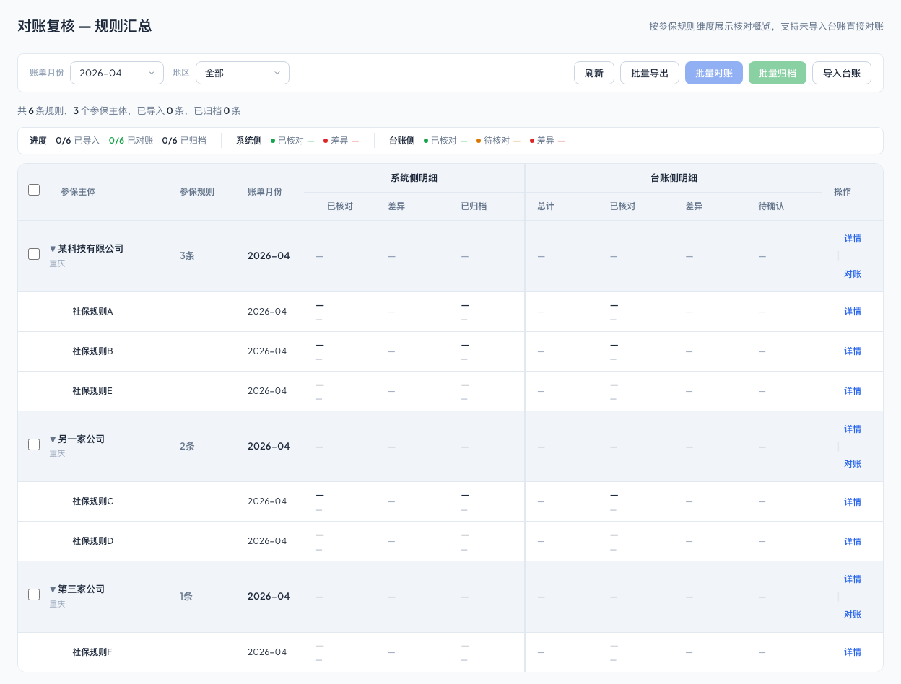
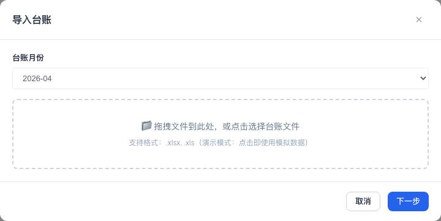
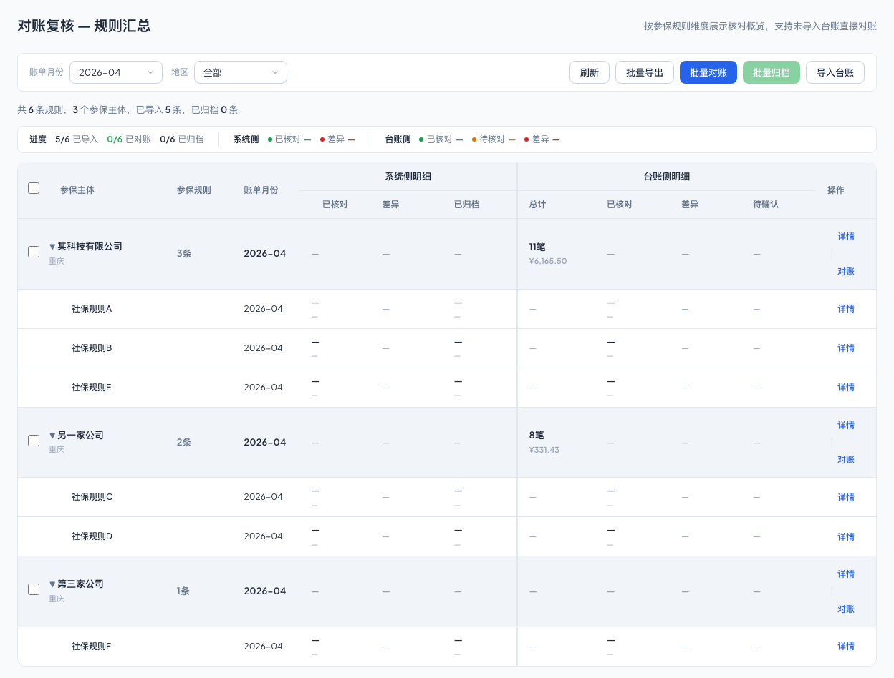
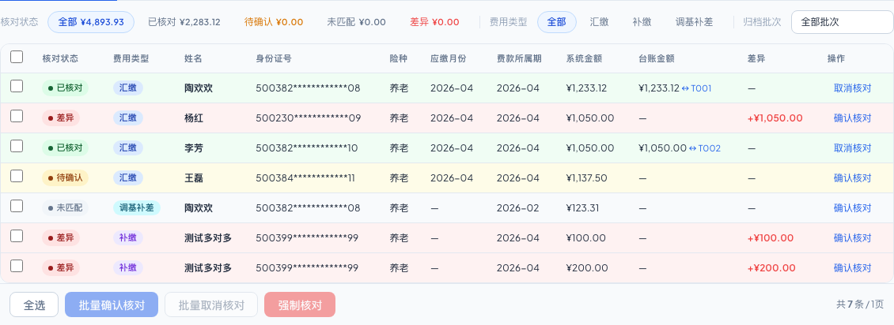
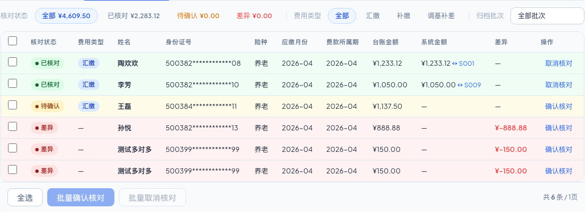
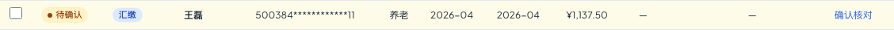
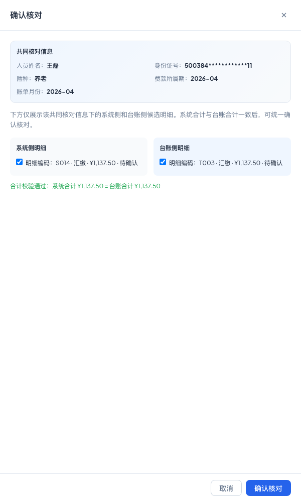
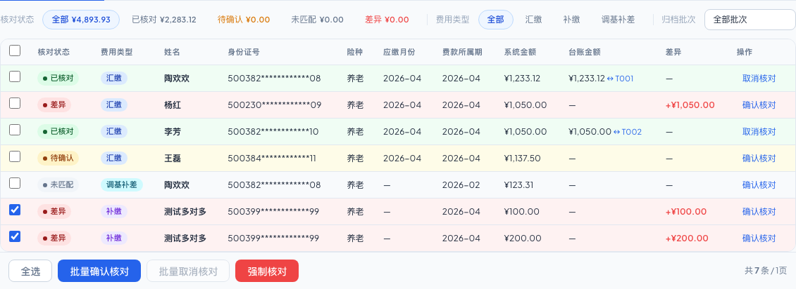
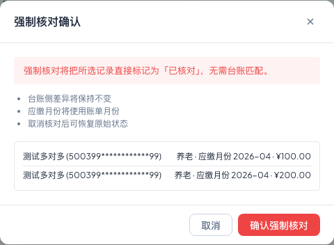
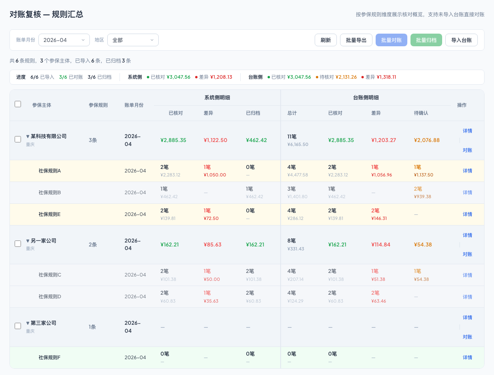

# 对账复核操作手册

本文档适用于客户侧社保专员，说明如何使用青阳云 HRO 的对账复核功能完成台账导入、账单核对、差异处理、结果归档和付款状态查看。

## 功能说明

对账复核用于核对系统侧账单明细与台账侧明细。社保专员可按账单月份查看各参保主体、参保规则的核对进度，导入台账后启动对账，并在明细页处理待确认、差异、未匹配等记录。

本功能支持以下常用操作：

- 按账单月份查看对账汇总。
- 导入当前账单月份的台账。
- 对参保主体或参保规则发起对账。
- 查看系统侧账单明细和台账侧明细。
- 对待确认、差异、未匹配记录执行确认核对。
- 对多条记录执行批量确认核对或批量取消核对。
- 对系统侧差异或未匹配记录执行强制核对。
- 将已核对结果归档，并查看归档批次和付款状态。

## 使用前准备

开始操作前，请确认以下事项：

- 已登录青阳云 HRO，并具备对账复核相关权限。
- 已明确本次要处理的账单月份。
- 已准备对应账单月份的台账文件。
- 台账中的人员、险种、费款所属期和金额信息已尽量核对完整。
- 如需归档或付款，请确认内部审批或业务确认流程已完成。

## 进入页面

在青阳云 HRO 中进入“对账复核”模块后，系统默认展示汇总页。汇总页用于查看各参保主体、参保规则在当前账单月份下的整体核对情况。

进入页面后，建议先确认左上角账单月份是否正确，再继续导入台账或开始对账。

## 汇总页说明

汇总页按参保主体和参保规则展示核对概览。切换账单月份时，主体和规则清单保持不变，表格中的账单月份和统计数据会按当前选择的月份展示。

汇总页常用区域如下：

| 区域 | 说明 |
|---|---|
| 账单月份 | 当前页面的对账账单月份。导入台账、查看明细、强制核对等操作均以该月份为准。 |
| 地区 | 按地区查看汇总数据。 |
| 批量对账 | 对已选择的参保规则批量发起对账。 |
| 批量归档 | 对符合条件的已核对结果批量归档。 |
| 导入台账 | 导入当前账单月份的台账文件。 |
| 汇总表 | 展示参保主体、参保规则、账单月份、台账导入情况、核对结果和归档情况。 |

点击汇总表中的参保规则或详情入口，可进入该规则对应的明细核对页。

## 导入台账

导入台账用于上传当前账单月份对应的台账文件。导入弹窗中的台账月份会自动继承汇总页选择的账单月份，不支持手动修改。

操作步骤：

1. 在汇总页确认账单月份。
2. 点击“导入台账”。
3. 在弹窗中确认台账月份。
4. 选择需要导入的台账文件。
5. 查看预览和校验结果。
6. 确认无误后提交导入。

如系统提示存在重复台账或校验异常，请按页面提示处理后再继续。

## 开始对账

导入台账后，可在汇总页或明细页点击“开始对账”。系统会根据当前账单月份对系统侧账单明细和台账侧明细进行初步核对，并生成已核对、待确认、差异、未匹配等结果。

操作建议：

- 优先从汇总页查看整体进度，再进入明细页处理异常记录。
- 若某个规则存在差异或未匹配，应进入明细页逐笔查看。
- 未导入台账时也可开始对账，系统侧记录会进入需要处理的状态，便于先查看缺少台账的范围。

## 明细页说明

明细页用于处理单个参保规则或参保主体下的账单明细。页面顶部会展示当前规则或主体名称，以及当前账单月份。

系统侧明细展示系统生成的账单记录，包括明细编码、人员姓名、险种、费款所属期、金额、核对状态和可执行操作。

台账侧明细展示导入台账中的记录，包括明细编码、人员姓名、险种、费款所属期、金额、推断类型、核对状态和可执行操作。

明细编码用于区分具体记录。处理确认核对、取消核对或排查差异时，建议优先核对明细编码，避免选择错误记录。

## 状态说明

| 状态 | 含义 | 常见处理方式 |
|---|---|---|
| 已核对 | 系统侧与台账侧已完成核对，或系统侧已完成强制核对。 | 可归档；未归档前可取消核对。 |
| 待确认 | 系统已找到可能匹配的记录，需要人工确认。 | 点击“确认核对”。 |
| 差异 | 系统侧与台账侧存在金额或信息差异。 | 查看差异原因，必要时执行确认核对或强制核对。 |
| 未匹配 | 当前记录未找到可直接匹配的对方记录。 | 检查对方列表，必要时执行确认核对或强制核对。 |
| 已归档 | 已核对结果已进入归档批次。 | 可查看详情，不可取消核对。 |
| 已付款 | 归档批次已完成付款处理。 | 可查看详情，不可取消核对。 |

## 确认核对

确认核对用于人工确认系统侧和台账侧记录的对应关系。待确认、差异、未匹配记录均可进入确认核对。

点击单条记录的“确认核对”后，页面会打开确认核对抽屉。抽屉上方会展示共同核对信息，包括人员姓名、险种、账单月份和费款所属期。两侧分别展示系统侧明细和台账侧候选明细。

确认核对时需满足以下条件：

- 两侧至少各选择一条明细。
- 两侧记录属于同一人员、同一险种、同一账单月份、同一费款所属期。
- 系统侧选择金额合计与台账侧选择金额合计一致。

可支持的选择方式包括一对一、一对多、多对一和多对多。若金额合计不一致，页面会提示差额，不能确认。

## 批量确认核对

批量确认核对是单条“确认核对”的批量入口，适用于需要一次选择多条待确认、差异或未匹配记录的场景。

操作步骤：

1. 在系统侧或台账侧列表勾选需要处理的记录。
2. 点击“批量确认核对”。
3. 在确认核对抽屉中核对共同信息。
4. 在另一侧勾选对应明细。
5. 确认两侧合计金额一致。
6. 点击“确认核对”完成处理。

批量确认核对仍需满足同一人员、同一险种、同一账单月份、同一费款所属期和金额合计一致的要求。

## 取消核对

取消核对用于撤销未归档的已核对记录。取消后，相关记录会恢复至核对前状态，社保专员可重新处理。

操作规则：

- 未归档的已核对记录可点击“取消核对”。
- 通过确认核对形成的一组记录会一起恢复。
- 已归档记录不可取消核对。
- 已付款记录不可取消核对。

如需要重新核对已归档或已付款记录，请先按公司内部流程处理对应归档或付款事项。

## 强制核对

强制核对是系统侧差异或未匹配记录的兜底处理方式，适用于确认不需要台账侧记录配对、但业务上需要将系统侧记录标记为已核对的场景。

操作步骤：

1. 在系统侧列表勾选一笔或多笔差异、未匹配记录。
2. 点击“强制核对”。
3. 阅读确认提示。
4. 确认无误后点击“确认强制核对”。

强制核对仅在系统侧提供。该操作不应作为日常高频处理方式，建议仅在确认业务口径明确时使用。

## 归档与付款状态

已核对记录可执行归档。归档后，记录进入归档批次，可在“归档记录”中查看批次明细，并从归档批次发起付款处理。

操作说明：

- “归档结果”会将符合条件的已核对记录生成归档批次。
- 若仍有待确认或差异记录，页面会提示是否继续归档已核对记录。
- “归档记录”用于查看历史归档批次、批次金额和记录数。
- 付款从归档批次发起，完成后相关记录显示为“已付款”。
- 已归档或已付款记录用于追溯，不再允许取消核对。

## 常见问题

| 问题 | 处理建议 |
|---|---|
| 切换账单月份后，参保主体和规则没有减少，是否正常？ | 正常。账单月份是当前页面的对账上下文，不用于减少主体和规则清单。 |
| 导入台账时月份不能修改，怎么办？ | 先关闭弹窗，在汇总页切换账单月份后重新导入。 |
| 点击确认核对后不能提交，怎么办？ | 检查两侧是否都已选择明细，并确认人员、险种、费款所属期和金额合计是否一致。 |
| 明细编码有什么用？ | 明细编码用于区分具体记录，尤其适合多笔同人员、同险种、同费款所属期的场景。 |
| 已归档记录还能取消核对吗？ | 不能。已归档记录只支持查看详情。 |
| 强制核对后还能恢复吗？ | 未归档前可通过取消核对恢复至核对前状态；归档或付款后不可取消。 |

## 注意事项

- 操作前请先确认账单月份，避免把台账导入到错误月份。
- 处理多笔记录时，请重点核对明细编码、人员姓名、险种和费款所属期。
- 确认核对前，应确保两侧金额合计一致。
- 强制核对只适合业务已确认的兜底场景，不建议代替正常确认核对。
- 归档前建议完成差异和未匹配记录处理，避免后续重复排查。
- 付款完成后，相关记录仅用于查看和追溯。

## 相关文档

- [[HOME|青阳云 HRO 知识库首页]]
- [[superpowers/specs/reconciliation/type-month-matching|对账复核主规格]]
- [[superpowers/prd/reconciliation/reconciliation|对账复核 PRD]]

## 版本记录

| 版本 | 日期 | 说明 |
|---|---|---|
| v0.1 | 2026-05-16 | 初稿，基于当前对账复核原型编写。 |
